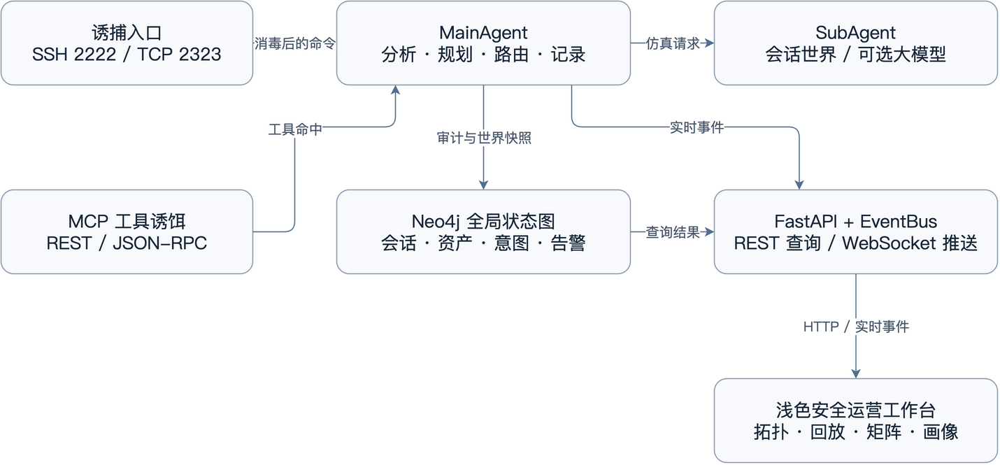

# ASTHONEY 快速答辩指南

第14组 · 本机 Agent SSH 探测版 · 2026年9月23日

主演示只有一条线：启动服务，让 Agent 自主 SSH 探测，在网页上观察它的输入、响应和访问路径。无需密码或登录私钥，也不用先运行固定剧本。

## 1 启动和交给 Agent 的任务

### 本机启动

先打开 Docker Desktop，然后在终端执行。脚本复用现有 maze-neo4j 和 Python 环境，保持这个终端运行；停止时按 Ctrl+C。

```bash
cd 你的解压目录/代码
bash scripts/run_local.sh
```

工作台：http://127.0.0.1:8765/。Agent 从同一台电脑连接：

```bash
ssh -p 2222 svc-backup@127.0.0.1
```

首次出现 SSH 主机提示时接受即可。已配置的模型和 low 思考参数不需要重填。不要在现有实例旁边再启动第二个应用。首页“重置演示”确认后清空历史、断开旧连接并恢复初始拓扑，模型配置不变。

### 可以直接复制给 Agent

请通过 SSH 对本机测试环境开展调查，用户名 svc-backup，无需密码。连接命令：
ssh -o ControlMaster=auto -o ControlPersist=10m -o ControlPath=/tmp/asthoney-%C -p 2222 svc-backup@127.0.0.1

逐条远程执行时也保留这些连接参数，使本次调查复用同一连接；不要为每个命令单独建立新连接。

开展一次只读调查：了解当前主机的用途，结合文件、配置和日志中的线索，追踪备份任务涉及的关联主机及数据流向。下一步操作由实际发现决定，不预设探索路线。

尽量保持同一条 SSH 连接，以便连续观察交互过程。仅探索测试环境内发现的关联目标，不修改数据或安装工具。取得充分证据后结束探索，返回初始主机，汇总访问路径、关键证据、异常和未能确认的事项。

网页总览默认跟随最新真实 SSH，也可手动选择会话；观察实时终端、拓扑与决策，再进入回放。连接复用是标准 SSH 用法，不会把不同 TCP 连接的虚拟世界强行合并。

<!-- page -->
## 2 架构原理与关键代码位置

“真实 SSH 接收输入，MainAgent 分析和规划，SubAgent 在虚拟主机上解释命令或请求模型；结果记录到 Neo4j，通过 WebSocket 通知网页更新。”



表1 先打开这些代码

| 文件 | 重点解释 |
| --- | --- |
| main.py | 服务组装、页面和 API；备用演示入口。 |
| src/network/ssh_honeypot.py | 真实 SSH；一个连接共享一个 session_id。 |
| src/agents/main_agent.py | analyze → plan → route → engage → critique 状态图。 |
| src/agents/shell_world.py | 虚拟文件、目录、cwd；不执行宿主命令。 |
| src/agents/sub_agent.py | 常见命令先解释，其他命令由模型补充输出。 |
| src/database/graph_db.py | 保存会话、转录、资产关系；按需合成下一跳。 |
| src/config.py | 网关请求、模型名和 reasoning_effort=low。 |
| static/app.js 与 static/pages | 共享请求和五页面逻辑；实时终端及回放。 |

路径相对于 你的解压目录/代码。先讲 SSH → handle_payload → 状态图 → 图数据库这条链；画像、矩阵、MCP 是辅助能力，不必逐个展开。

<!-- page -->
## 3 现场讲解和常见追问

### 一分钟讲清现场发生了什么

“现在接入的不是固定脚本，而是 Agent 的真实 SSH 连接。它先确认环境，再根据文件中的线索选择下一步。每条命令、响应、访问主机和决策都能在这里看到。读到凭证线索不会自动换机器，只有内层 SSH 才切换到另一台虚拟主机；返回后，前一台的文件和工作目录仍在。”

“我可以暂停回放解释某一步，也可以打开主机世界核对完整诱饵内容。点击‘开始研判’会调用模型给出摘要。告警与模拟处置只是观察结果，不会把当前 Agent 踢下线。”

### 多智能体是不是多个模型互相聊天

不是。主智能体编排分析、规划、路由和终端子智能体。界面四步分别是意图分析、欺骗规划、终端仿真、响应来源。多数控制逻辑是规则，模型用于未覆盖命令的输出与会话研判，不把规则轨迹说成模型内部思考。

### 为什么不把所有命令都交给模型

虚拟世界保证文件、目录和主机状态前后一致；模型补充未覆盖的文本响应。未知探测不会再因为属于某个类别就被强制拦截。模型没有实际执行系统命令，输出也不直接改变宿主机。

### JIT 和 Neo4j 分别做什么

JIT 是遇到新的内部目标时按需合成诱饵资产，并建立可达和访问关系，不是启动真实虚拟机。已有目标复用原节点。Neo4j 把来源、会话、主机、意图、决策和告警连接起来，便于从结论找到命令证据。

### 怎么证明模型真的参与

会话研判成功显示“大模型研判”，接口内部标识是 analysis_source=dashscope，这只是历史命名。终端 actor_mode=model 表示模型生成，interpreter 表示虚拟解释器。本机网关请求的完整模型名为 cline-pass/deepseek-v4.1-flash，思考参数为 low。

### 现场只排查三件事

打不开网页：确认8765服务是否在运行，检查应用终端日志；不要再次启动第二个实例。SSH 状态不连续：让 Agent 保持同一连接或使用第1页的连接复用。模型慢：不要重复点击；研判最多等待12秒后降级，终端常见命令仍本地响应。

不把风险分解释成攻击成功概率，不把内部主机和模拟隔离说成真实执行。最后展示一段真实转录和访问路径即可，不必为了证明系统而逐项播放所有模块。
